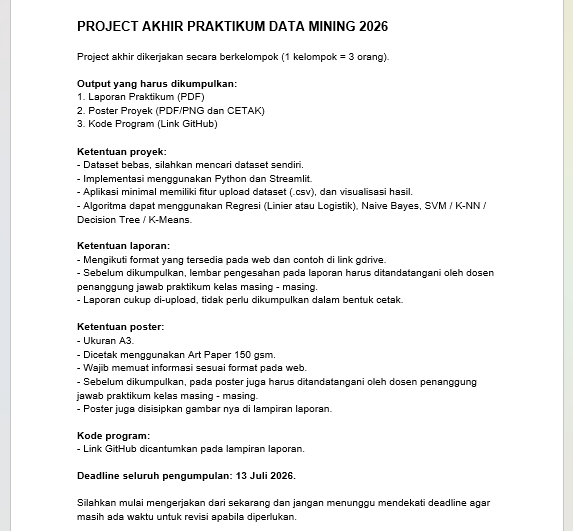
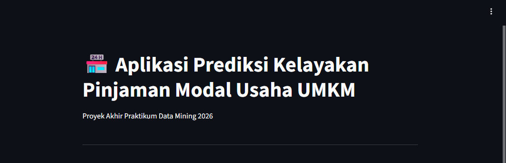
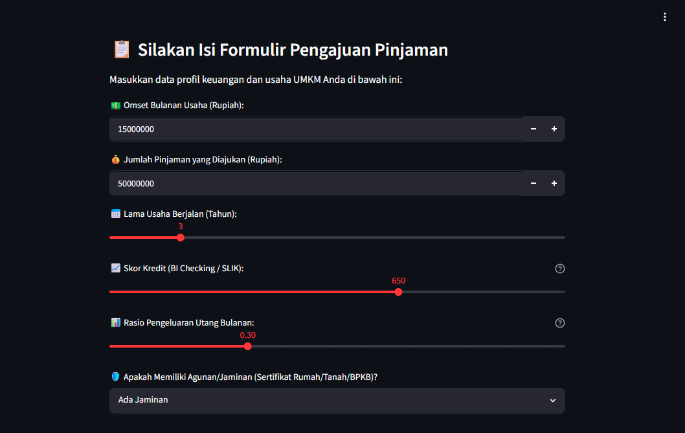
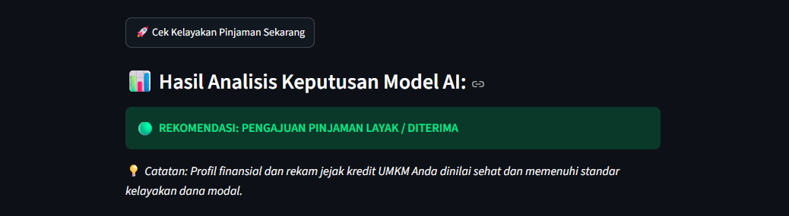

# Tugas Praktikum Akhir Kelompok 8 

|Nama|NIM|Kelas|Mata Kuliah|
|----|---|-----|------|
|**Radityatama Nugraha**|**312310644**|**I.23.1D**|**Praktikum Data Mining**|
|**Faris Fadhil Shafwanda**|**312310295**|**I.23.1D**|**Praktikum Data Mining**|
|**Romi Rahman**|**312310581**|**I.23.1D**|**Praktikum Data Mining**|

---

## Soal Projek Akhir Praktikum :



---

##  • Pembuatan Dataset Simulasi UMKM
```python
import pandas as pd
import numpy as np

np.random.seed(42)
n_samples = 1000

data = {
    'Omset_Bulanan': np.random.randint(5, 100, n_samples) * 1000000, 
    'Jumlah_Pinjaman': np.random.randint(10, 200, n_samples) * 1000000, 
    'Lama_Usaha_Tahun': np.random.randint(1, 15, n_samples), 
    'Skor_Kredit': np.random.randint(300, 850, n_samples),
    'Rasio_Utang': np.round(np.random.uniform(0.1, 0.8, n_samples), 2), 
    'Status_Agunan': np.random.choice([1, 0], n_samples, p=[0.7, 0.3])
}

df = pd.DataFrame(data)

kelayakan = []
for idx, row in df.iterrows():
    if row['Skor_Kredit'] >= 600 and row['Rasio_Utang'] <= 0.5:
        kelayakan.append(1)
    elif row['Omset_Bulanan'] >= (row['Jumlah_Pinjaman'] / 12) and row['Status_Agunan'] == 1 and row['Skor_Kredit'] >= 500:
        kelayakan.append(1)
    else:
        kelayakan.append(0)

df['Kelayakan_Pinjaman'] = kelayakan

df.to_csv('dataset_pinjaman_umkm.csv', index=False)
print("Sukses! File 'dataset_pinjaman_umkm.csv' berhasil dibuat di folder Colab.")
df.head()
```

---

### Penjelasan :
```
- Simulasi Data (np.random): Membuat 1.000 data acak profil UMKM sebagai bahan dasar pelatihan model AI.
- Variabel Finansial: Menyusun kriteria penting perbankan seperti omset, jumlah pinjaman, lama usaha, skor kredit (BI Checking), rasio utang, dan jaminan (agunan).
- Aturan Kelayakan (Looping If-Else): Menentukan label target (1 = Layak, 0 = Ditolak) berdasarkan logika skor kredit bersih atau omset kuat yang didukung jaminan fisik.
- Output (.to_csv): Menyimpan seluruh data hasil pelabelan ke dalam file dataset_pinjaman_umkm.csv untuk dipakai di tahap training.
```

---

##  • Pelatihan dan Penyimpanan Model Decision Tree
```python
import pickle
from sklearn.model_selection import train_test_split
from sklearn.tree import DecisionTreeClassifier
from sklearn.metrics import accuracy_score

X = df[['Omset_Bulanan', 'Jumlah_Pinjaman', 'Lama_Usaha_Tahun', 'Skor_Kredit', 'Rasio_Utang', 'Status_Agunan']]
y = df['Kelayakan_Pinjaman']

X_train, X_test, y_train, y_test = train_test_split(X, y, test_size=0.2, random_state=42)

model_umkm = DecisionTreeClassifier(max_depth=5, random_state=42)
model_umkm.fit(X_train, y_train)

y_pred = model_umkm.predict(X_test)
Akurasi = accuracy_score(y_test, y_pred)
print(f"Model selesai dilatih! Akurasi Model: {Akurasi * 100:.2f}%")

with open('model_pinjaman_umkm.pkl', 'wb') as file:
    pickle.dump(model_umkm, file)
print("File 'model_pinjaman_umkm.pkl' berhasil disimpan dan siap dipakai di Streamlit!")
```

---

### Penjelasan :
```
- Pemisahan Variabel (X dan y): Membagi data menjadi fitur input X (kondisi keuangan) dan target output y (label kelayakan pinjaman).
- Pembagian Data (Data Splitting): Memisahkan dataset menjadi 80% untuk data latih (training) dan 20% untuk data uji (testing).
- Pelatihan Model AI (fit): Melatih algoritma Decision Tree Classifier dengan pembatasan pohon (max_depth=5) agar model tidak terlalu kompleks (overfitting).
- Evaluasi Akurasi: Menguji performa model menggunakan data uji untuk melihat seberapa akurat kecerdasan buatan dalam memprediksi kelayakan.
- Penyimpanan Ekspor (pickle): Menyimpan model AI yang sudah pintar ke dalam file biner model_pinjaman_umkm.pkl agar bisa dipanggil langsung oleh web Streamlit.
```

---

##  • Instalasi Environment dan Dependencies
```python
!pip install -q streamlit

!npm install -g localtunnel
```

---

### Penjelasan :
```
- Instalasi Framework (!pip install): Memasang pustaka Streamlit di komputer virtual Google Colab untuk membangun antarmuka web aplikasi.
- Pemasangan Terowongan (!npm install): Memasang alat Localtunnel untuk menjembatani dan membuka akses server lokal Google Colab agar bisa dibuka melalui browser laptop pribadi.
```

---

##  • Pembuatan Script Aplikasi Web Streamlit (app.py)
```python
%%writefile app.py
import streamlit as st
import pandas as pd
import pickle
import numpy as np

st.set_page_config(page_title="Prediksi Kelayakan Pinjaman UMKM", layout="centered")

st.title("🏪 Aplikasi Prediksi Kelayakan Pinjaman Modal Usaha UMKM")
st.write("Proyek Akhir Praktikum Data Mining 2026")
st.write("---")

@st.cache_resource
def load_model():
    with open('model_pinjaman_umkm.pkl', 'rb') as file:
        model = pickle.load(file)
    return model

try:
    model = load_model()
    st.sidebar.success("🧠 Otak Model ML Berhasil Dimuat!")

    st.subheader("📋 Silakan Isi Formulir Pengajuan Pinjaman")
    st.write("Masukkan data profil keuangan dan usaha UMKM Anda di bawah ini:")

    omset_bulanan = st.number_input("💵 Omset Bulanan Usaha (Rupiah):", min_value=0, value=15000000, step=1000000)
    jumlah_pinjaman = st.number_input("💰 Jumlah Pinjaman yang Diajukan (Rupiah):", min_value=0, value=50000000, step=1000000)
    lama_usaha = st.slider("📅 Lama Usaha Berjalan (Tahun):", min_value=0, max_value=20, value=3)
    skor_kredit = st.slider("📈 Skor Kredit (BI Checking / SLIK):", min_value=300, max_value=850, value=650, help="Rentang skor 300-850. Semakin tinggi semakin bersih riwayat kredit Anda.")
    rasio_utang = st.slider("📊 Rasio Pengeluaran Utang Bulanan:", min_value=0.0, max_value=1.0, value=0.3, step=0.05, help="Persentase omset yang habis untuk bayar cicilan utang lain saat ini.")

    agunan_pilihan = st.selectbox("🛡️ Apakah Memiliki Agunan/Jaminan (Sertifikat Rumah/Tanah/BPKB)?", ["Ada Jaminan", "Tidak Ada Jaminan"])
    status_agunan = 1 if agunan_pilihan == "Ada Jaminan" else 0

    st.write("---")

    if st.button("🚀 Cek Kelayakan Pinjaman Sekarang"):

        input_data = np.array([[omset_bulanan, jumlah_pinjaman, lama_usaha, skor_kredit, rasio_utang, status_agunan]])

        prediksi = model.predict(input_data)

        st.subheader("📊 Hasil Analisis Keputusan Model AI:")
        if prediksi[0] == 1:
            st.success("🟢 **REKOMENDASI: PENGAJUAN PINJAMAN LAYAK / DITERIMA**")
            st.balloons() 
            st.write("💡 *Catatan: Profil finansial dan rekam jejak kredit UMKM Anda dinilai sehat dan memenuhi standar kelayakan dana modal.*")
        else:
            st.error("🔴 **REKOMENDASI: PENGAJUAN PINJAMAN BELUM LAYAK / DITOLAK**")
            st.write("⚠️ *Saran Perbaikan: Coba turunkan nominal jumlah pinjaman yang diajukan, tingkatkan omset usaha bulanan, atau bersihkan riwayat tunggakan kredit Anda terlebih dahulu agar skor kredit naik.*")

except FileNotFoundError:
    st.error("File model_pinjaman_umkm.pkl tidak ditemukan di folder server!")
except Exception as e:
    st.error(f"Terjadi kesalahan sistem: {str(e)}")
```

---

### Penjelasan :
```
- Pembuatan Berkas (%%writefile app.py): Perintah khusus Colab untuk mengekspor seluruh blok kode di bawahnya menjadi sebuah file skrip Python bernama
- Inisialisasi Antarmuka (UI): Mengatur judul, teks pengantar halaman web, dan menggunakan fungsi @st.cache_resource agar pemuatan model AI berjalan cepat tanpa membebani memori.
- Formulir Form Interaktif: Membangun kolom input angka (st.number_input), geseran nilai (st.slider), dan menu pilihan (st.selectbox) untuk diisi oleh pelaku UMKM.
- Pemrosesan Prediksi Real-Time: Mengubah data input formulir menjadi matriks numpy array, lalu dimasukkan ke fungsi model.predict() untuk mengecek kelayakan secara instan.
- Output Keputusan Dinamis: Menampilkan rekomendasi visual berupa kotak hijau (LAYAK) disertai efek balon animasi jika disetujui, atau kotak merah (BELUM LAYAK) lengkap dengan tips perbaikan finansial jika ditolak.
```

---

##  • Eksekusi dan Aktivasi Server Web
```python
import urllib
print("Password Terowongan Anda:", urllib.request.urlopen('https://ipv4.icanhazip.com').read().decode('utf8').strip())

!streamlit run app.py & npx localtunnel --port 8501
```

---

### Penjelasan :
```
- Pengambilan IP Publik (urllib): Mengambil alamat IP publik dari server virtual Google Colab untuk digunakan sebagai password keamanan (Endpoint Password) saat membuka Localtunnel.
- Menjalankan Streamlit (streamlit run): Mengaktifkan server lokal aplikasi web app.py di dalam latar belakang sistem menggunakan port default 8501.
- Membuka Akses Publik (npx localtunnel): Menghubungkan port 8501 ke internet melalui layanan Localtunnel, sehingga menghasilkan link URL eksternal khusus yang bisa diklik untuk membuka web tersebut dari browser laptop.
```

---

##  • Tampilan Awal Web Streamlit



---

### Penjelasan :
```
- Gambar di atas menampilkan bagian header (halaman utama) aplikasi web Streamlit. 
```

---

##  • Form Input Data Usaha



---

### Penjelasan :
```
- Gambar di atas menampilkan formulir input interaktif pada aplikasi web. Bagian ini berfungsi sebagai wadah bagi pengguna untuk memasukan data profil keuangan dan operasional UMKM (omset, jumlah pinjaman, lama usaha, skor kredit, rasio utang, dan jaminan) sebelum diproses oleh model AI.
```

---

##  • Output Prediksi Hasil Analisis Model AI



---

### Penjelasan :
```
- Gambar di atas menampilkan komponen output atau hasil keputusan akhir dari aplikasi web Streamlit. Sistem berhasil menampilkan rekomendasi status kelayakan pinjaman berwarna hijau secara dinamis berdasarkan kalkulasi prediksi cerdas dari model kecerdasan buatan.
```

---
